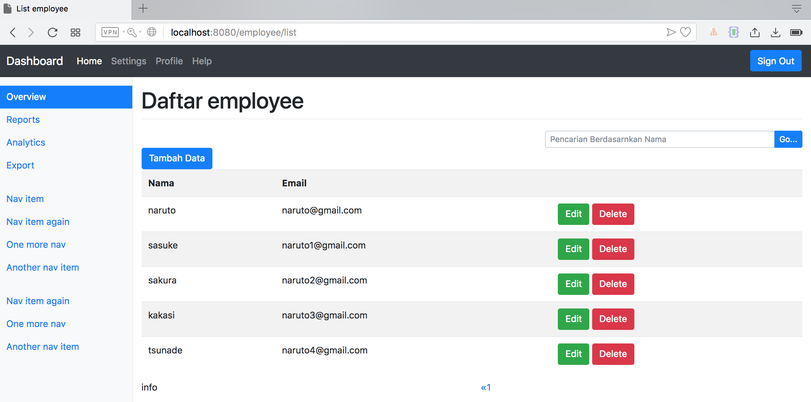
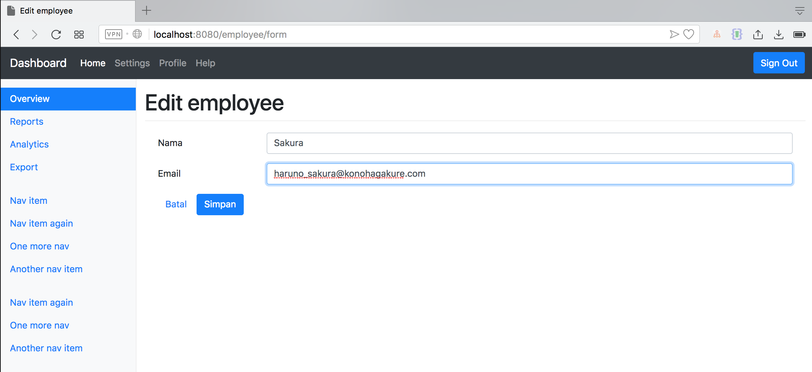

# spring-boot-crud-employee

#### Untuk menjalankan : `mvn spring-boot:run`

Access Local: `http://localhost:8080/login`

|No | Username | Password |
|---| ---------| ---------|
|1|naruto|123|
|2|sasuke|123|
|3|kakashi|123|

Login Employee

List Employee

Add Employee

